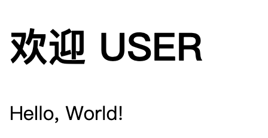
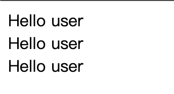
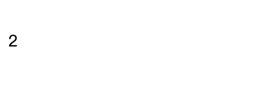
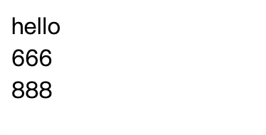
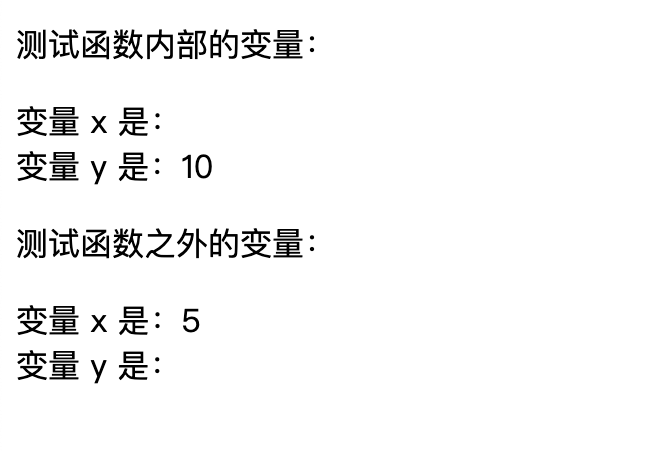
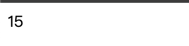
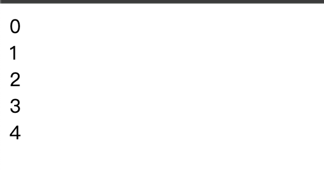

Rinton's work experience.
# 准备工作：
下载phpstudy启动apache及mysql
https://old.xp.cn/

浏览器访问127.0.0.1
将自建文件夹（PHP）安装在phpstudy的WWW目录下
开始我们的php语言学习之旅

基础PHP语法：
<?php开头，以?>结尾
默认.php结尾
php语句以 ; 结尾

<?php
    代码;
?>

# 一、语法和变量
# 1.php结合html，利用内置函数echo输出“Hello, World!”:
1.php  
浏览器 127.0.0.1/1.php显示  
>> 欢迎 USER  
>> Hello, World!

# 2.php注释
单行注释  
#，//   
多行注释  
/* */  
2.php  
浏览器 127.0.0.1/2.php显示   
>> start php now

# 3.php大小写敏感
函数、类、关键词不敏感
3.php
>>  Hello user  
>>  Hello user  
>>  Hello user  
所有变量敏感
4.php
>> error 报错  
>> 2  //正常变量a的值

# 4.php变量规则
$开头  
$a $A  
$a1 $A2  
$_a1 $_2a  
$a_1 $A_2  
不能以数字开头  
包含：a-z, 0-9, _

# 5.创建变量
变量在首次被赋值时创建
区别：C、C++ 无需判断给出类型
5.php
>> hello  
>> 666    
>> 888

# 6.变量作用域
local global static  
6.php  
>> 函数内声明，局部变量，无法在全局输出  

7.php  
>> 全局变量，外部声明，无法在函数内使用 需要用 global $x  

8.php  
>> 函数执行完成会删除所有变量，想要不删除某个局部变量，则需首次使用声明static

