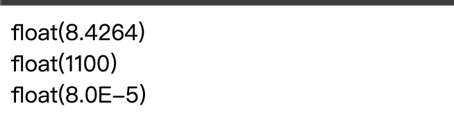
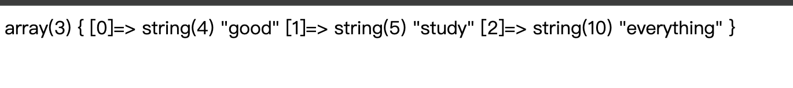

# 标量
integer     float/double      string       boolean  

# 复合
array       object

# 特殊
resource        NULL

# 1.字符串string
单引号： '' 变量原样输出，不会解析，效率最高

双引号： "" 变量会自动被替换成变量值
>> 1.php

# 2.整型int
常见格式    
var_dump() 会同时输出变量的类型和值     
>> 2.php    

>> 1.十进制2.十六进制（0x为前缀）3.八进制（0为前缀）    
注意：php7特性 含有十六进制字符的字符串不再被视为数字，而是被当作普通的字符串

# 3.浮点型float/double
>> 3.php

# 4.布尔型boolean
不区分大小写    
>>  $a=true;        
>>  $b=false;       

# 5.数组array
在PHP里数组的索引可以是数字，也可以是字符串     
>> 4.php

# 6.对象object
封装，多态，继承.   
存储数据和有关如何处理数据的信息    
类是包含属性和方法的结构    
class   

# 7.NULL
空/ 被unset()处理过     
>> 5.php    

# 8.Resource
保存着对外部数据源的引用，如文件、数据库连接等，直到通信结束    
数据库持久连接是一种比较特殊的资源，它不会被垃圾回收系统释放，需要手动释放  

