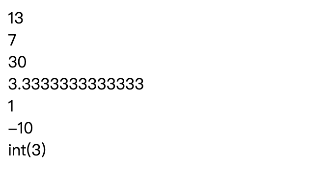
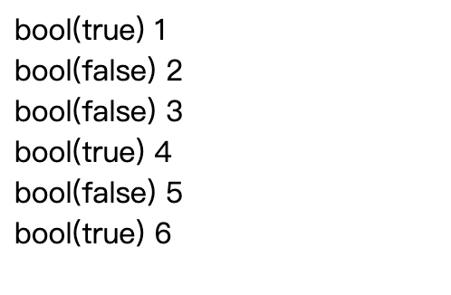
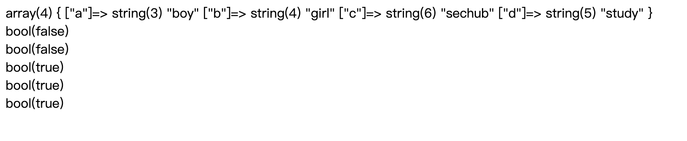
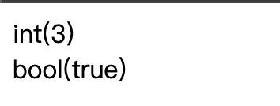

# php运算符

# 1.算术运算符
>> 1.php    
>> 区别C、C++ ， / 运算时，不是整除，会保留小数     
>> intdiv()整除运算符   

# 2.赋值运算符  
>> 2.php

# 3.递增/递减运算符
>> 3.php

# 4.比较运算符
>> 4.php

# 5.逻辑运算符
&& || ! and or xor异或

# 6.数组运算符
>> 5.php

# 7.三元运算符
>> 6.php

# 8.组合比较符(PHP7+)
>> $c = $a <=> $b;      
>> 1 0 -1
>> 7.php

# 9.运算符优先级
>> 8.php

# 10.括号的使用
>> 提高优先级   
>> 9.php
