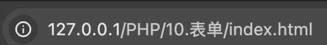
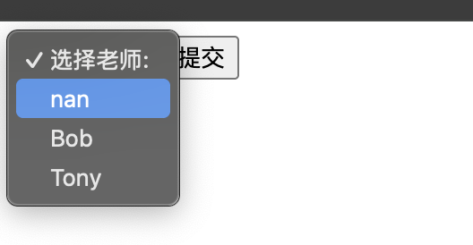

# 1.PHP 表单
PHP 中的 $_GET 和 $_POST 变量用于检索表单中的信息，比如用户输入。   
一句话：获取信息    
注意：处理 HTML 表单时，PHP 能把来自 HTML 页面中的表单元素自动变成可供 PHP 脚本使用

>> 两个输入框，一个提交按钮     
>> 表单数据会送往（post）提交到look.php
```html
index.html:

<!DOCTYPE html>
<html lang="en">
<head>
	<meta charset="UTF-8">
	<title>nan</title>
</head>
<body>

<form action="look.php" method="post">
登录: <input type="text" name="name">
密码: <input type="password" name="password">
<input type="submit" value="登录">

</form>
</body>
</html>
```

```php
欢迎<?php echo $_POST["name"]; ?>!<br>
你的密码是 <?php echo $_POST["password"]; ?>  。
```



提交表单后会触发跳转 => look.php

# 2.获取下拉菜单的数据
表单使用 GET 方式获取数据，action 属性值为空表示提交到当前脚本      
通过 select 的 name 属性获取下拉菜单的值  
>> 1.php  
```php
<?php
if($q) {
        if($q =='nan') {
                echo 'nan老师精通python语言。';
        } else if($q =='Bob') {
                echo 'Bob老师精通Go语言。';
        } else if($q =='Tony') {
                echo 'Tony老师全能大师';
        }
} 
?>
<form action="" method="get"> 
    <select name="q">
    <option value="">选择老师:</option>
    <option value="nan">nan</option>
    <option value="Bob">Bob</option>
    <option value="Tony">Tony</option>
    </select>
    <input type="submit" value="提交">
    </form>
```

选择nan老师