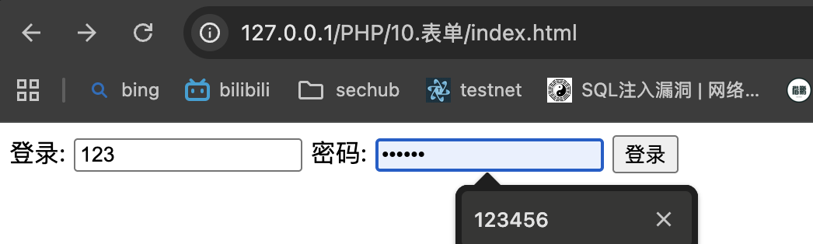

# PHP 表单
PHP 中的 $_GET 和 $_POST 变量用于检索表单中的信息，比如用户输入。   
一句话：获取信息    
注意：处理 HTML 表单时，PHP 能把来自 HTML 页面中的表单元素自动变成可供 PHP 脚本使用

>> 两个输入框，一个提交按钮     
>> 表单数据会送往（post）提交到look.php
```html
index.html:

<!DOCTYPE html>
<html lang="en">
<head>
	<meta charset="UTF-8">
	<title>nan</title>
</head>
<body>

<form action="look.php" method="post">
登录: <input type="text" name="name">
密码: <input type="password" name="password">
<input type="submit" value="登录">

</form>
</body>
</html>
```

