# 1.PHP 表单
PHP 中的 $_GET 和 $_POST 变量用于检索表单中的信息，比如用户输入。   
一句话：获取信息    
注意：处理 HTML 表单时，PHP 能把来自 HTML 页面中的表单元素自动变成可供 PHP 脚本使用

>> 两个输入框，一个提交按钮     
>> 表单数据会送往（post）提交到look.php
```html
index.html:

<!DOCTYPE html>
<html lang="en">
<head>
	<meta charset="UTF-8">
	<title>nan</title>
</head>
<body>

<form action="look.php" method="post">
登录: <input type="text" name="name">
密码: <input type="password" name="password">
<input type="submit" value="登录">

</form>
</body>
</html>
```

```php
欢迎<?php echo $_POST["name"]; ?>!<br>
你的密码是 <?php echo $_POST["password"]; ?>  。
```


提交表单后会触发跳转 => look.php

# 2.获取下拉菜单的数据
表单使用 GET 方式获取数据，action 属性值为空表示提交到当前脚本      
通过 select 的 name 属性获取下拉菜单的值  
>> 1.php  
```php
<?php
if($q) {
        if($q =='nan') {
                echo 'nan老师精通python语言。';
        } else if($q =='Bob') {
                echo 'Bob老师精通Go语言。';
        } else if($q =='Tony') {
                echo 'Tony老师全能大师';
        }
} 
?>
<form action="" method="get"> 
    <select name="q">
    <option value="">选择老师:</option>
    <option value="nan">nan</option>
    <option value="Bob">Bob</option>
    <option value="Tony">Tony</option>
    </select>
    <input type="submit" value="提交">
    </form>
```

选择nan老师

# 3.单选按钮表单
>> 2.php
```php
<?php
// 1. 先判断 URL 里有没有 'q' 这个参数，防止报错
if (isset($_GET['q'])) {
    
    // 2. 从 $_GET 数组中取出 'q' 的值
    $q = $_GET['q']; 

    if ($q == 'nan') {
        echo 'you are a boy  !';
    } else if ($q == 'nv') {
        echo 'you are a girl  !';
    } else {
        echo "请进行选择！！";
    }
}
?>
<form action="" method="get"> 
    <input type="radio" name="q" value="nan" />男
    <input type="radio" name="q" value="nv" />女
    <input type="submit" value="提交">
</form>
```
radio 圈, 键 q, 值 nan / nv   
  
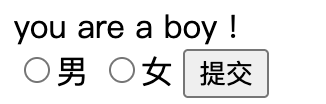

修改nan为nv     
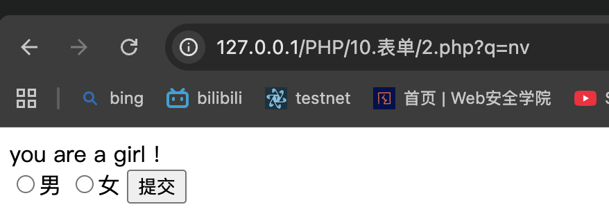
修改为其他任意
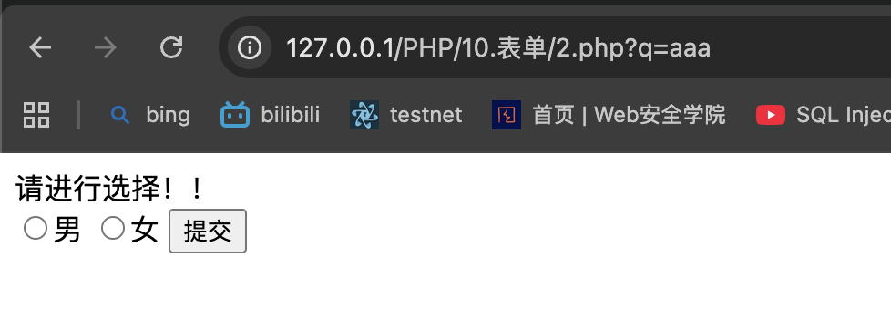

# 4.checkbox 复选框
可选择多个值    
```php
<?php
$q = isset($_POST['q'])? $_POST['q'] : '';
if(is_array($q)) {
    $sites = array(
            'nan' => 'nan老师精通python语言。',
            'bob' => 'Bob老师精通Go语言。',
            'tony' => 'Tony老师全能大师',
    );
    foreach($q as $val) {
        
        echo $sites[$val] . "<br>";
    }
      
} else {
?><form action="" method="post"> 
    <input type="checkbox" name="q[]" value="nan"> nan<br> 
    <input type="checkbox" name="q[]" value="bob"> Bob<br> 
    <input type="checkbox" name="q[]" value="tony"> Tony<br>
    <input type="submit" value="提交">
</form>
<?php
}
?>
```
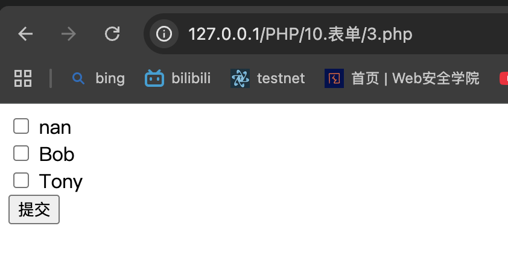
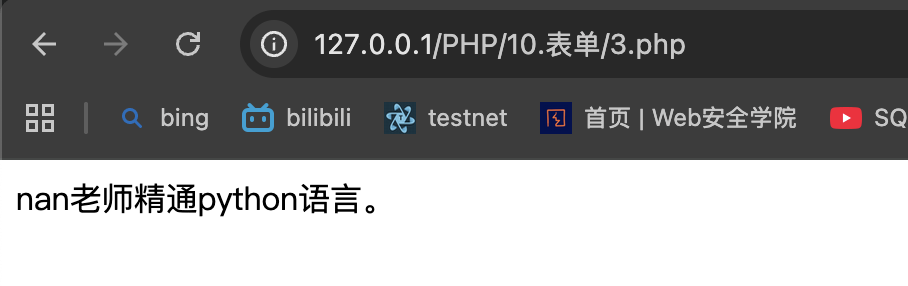
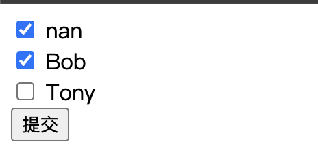
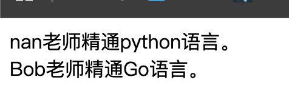

# 5.表单的非空判断
>> empty() 函数 检查是否为空    
>> empty.php
```php
<?php
$str1="";
$str2='SecHub';
if (empty($str1))
{
    echo '$str1' . " 为空或为 0。" . "<br>";
}
else
{
    echo '$str1' . " 不为空或不为 0。" . "<br>";
}
if (empty($str2))
{
    echo '$str2' . " 为空或为 0。" . "<br>";
}
else
{
    echo '$str2' . " 字符串不为空或不为0。" . "<br>";
}
?>
```
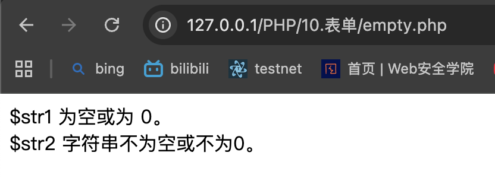

# 表单实例

# 6.1登录表单
>> login.php
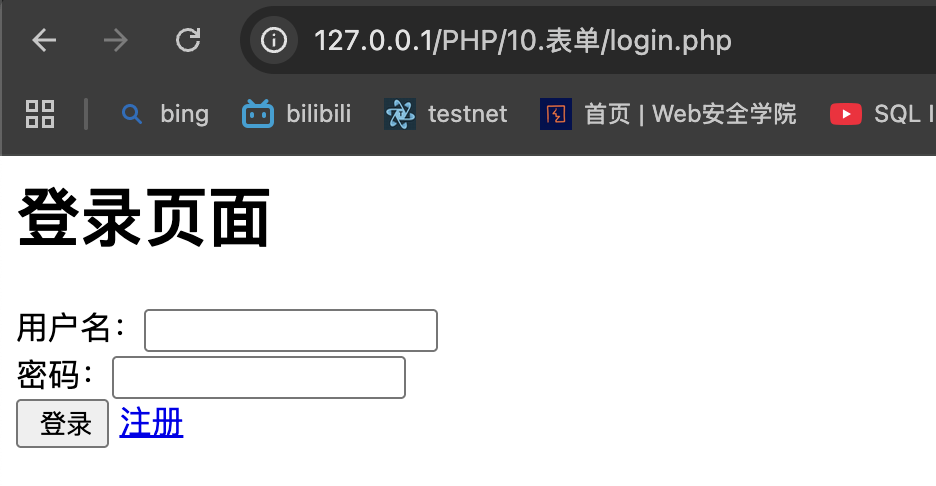
_blank 新标签页跳转     

# 6.2注册表单
>> register.php
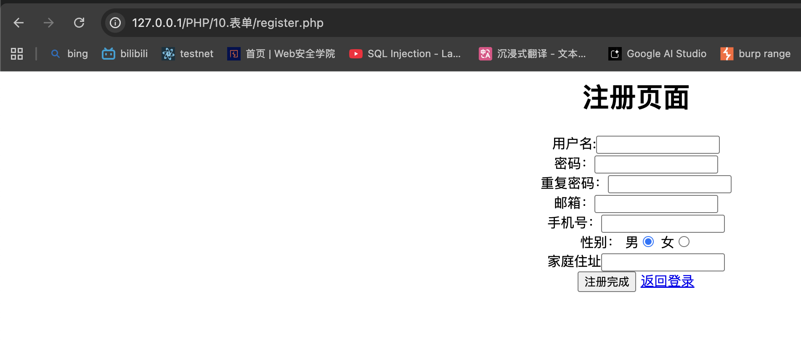

# 6.3留言表单
>> message.php


# 6.4个人中心表单
>> percenter.php
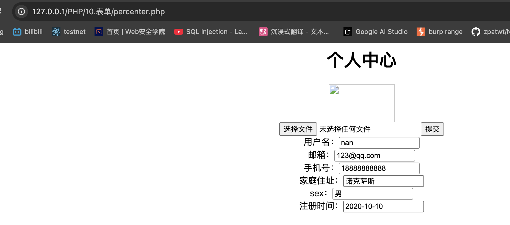


