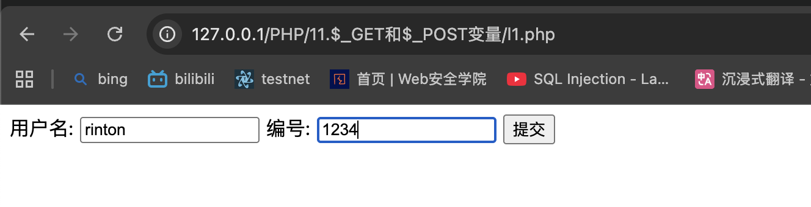
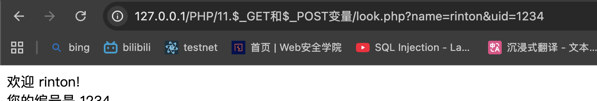
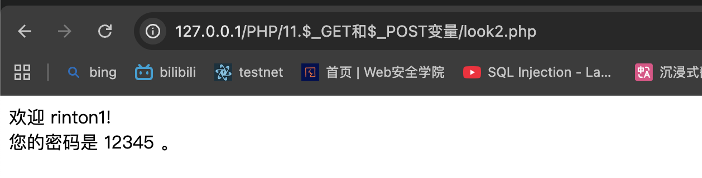

# 预定义的 $_GET 变量用于收集来自 method=“get” 的表单中的值

# 1.$_GET 变量
>> l1.php
```php
<form action="look.php" method="get">
用户名: <input type="text" name="name">
编号: <input type="text" name="uid">
<input type="submit" value="提交">
</form>
```


look.php 通过_GET变量来收集表单数据     
name=rinton&uid=1234
>> 在HTML表单中使用method="get"时，所有变量名和值都会显示在URL中，因此在发送密码或其他敏感信息时，不应该使用该方法

# 2.$_POST 变量
POST方法的表单发送的消息，对任何人都是不可见的      8MB
>> l2.php

没有显示相关信息    

注意：look.php 和 look2.php 区别在于method 一个是$_GET 一个是$_POST

# 3.GET和POST的区别：
GET请求会被cache，也就是GET请求能够被保持在浏览器中，尤其是当GET提交密码等重要数据，别人查看历史记录，便可直接看到这些私密数据，而POST不会进行cache。(cache：储存缓存)      
GET参数带在URL后面      
GET安全性非常低，POST安全性较高         
······


