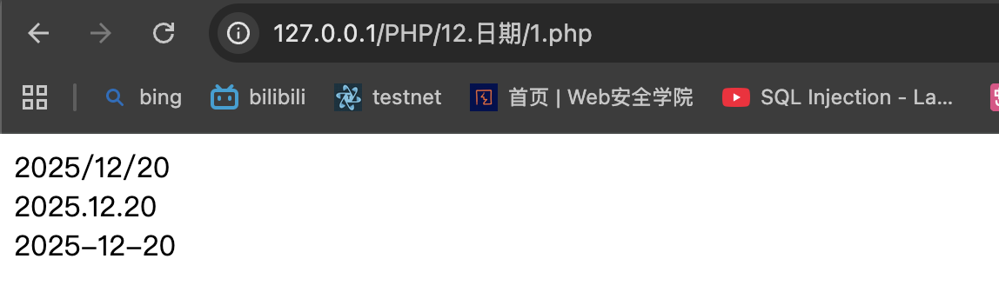

# PHP 日期
data()
```php
string date ( string $format [, int $timestamp ] )
//format：必需。规定时间戳的格式
//timestamp：可选。规定时间戳。默认是当前的日期和时间
// 1.php
<?php
echo date("Y/m/d") . "<br>";
echo date("Y.m.d") . "<br>";
echo date("Y-m-d");
?>
```
