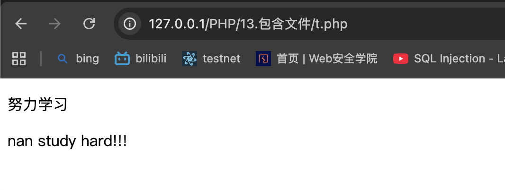

# include 和 require

# 1.
require 生成一个致命错误（E_COMPILE_ERROR），在错误发生后脚本会停止执行

# 2.
include 生成一个警告（E_WARNING），在错误发生后脚本会继续执行

希望继续执行，哪怕文件已丢失，选择include。     
否则选择require提高应用程序的安全性和完整性。
```php
include 'filename';

或者

require 'filename';

```

>> 在t.php文件中引入test1.php



>> t2.php
调用文件后使用其变量        
