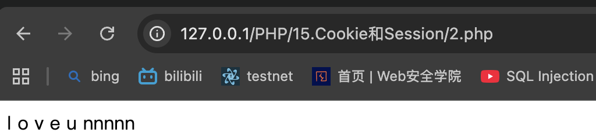
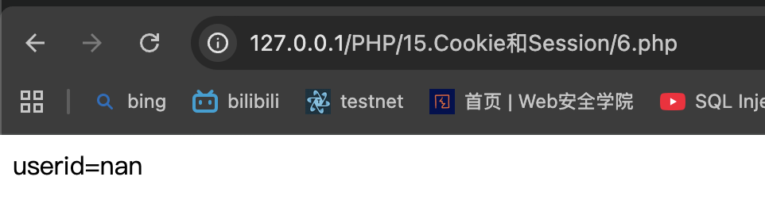

# Cookie和Session的简介
用于在Web应用程序中存储和管理用户状态信息的机制     
Cookie是由Web服务器发送给Web浏览器的小数据文件，存储在用户计算机上。它可以包含有关用户的个人偏好设置、登录凭据等信息。每次用户访问该站点时，浏览器会将cookie发送回服务器，以方便Web服务器识别和跟踪用户     
>> 一句话：存储临时登录信息     

Session则是在服务器端创建的一段时间内存储用户状态的机制。当用户首次访问网站时，web服务器会为其分配一个唯一的session ID，并将该ID存储在cookie中。Web浏览器将在每个请求中发送该cookie，以便Web服务器可以将请求与正确的会话关联起来    
>> 一句话：方便服务端识别用户id，调用对应cookie     

Cookie存储客户端数据，而Session存储服务器端数据，并且Session比Cookie更安全，因为所有的Session数据都存储在服务器端           

# 1.创建 cookie
setcookie()     
setcookie() 函数必须位于 <html> 标签之前    
```php    
setcookie(name, value, expire, path, domain);
/**
 * name	必需。规定 cookie 的名称。
 * value	必需。规定 cookie 的值。
 * expire	可选。规定 cookie 的过期时间。
 * path	可选。规定 cookie 的服务器路径。
 * domain	可选。规定 cookie 的域名。
 * secure	可选。规定是否需要在安全的 HTTPS 连接来传输 cookie。
 */
```

>> 1.php
创建cookie key and value

# 2.在其他页面中取回 Cookie 的值
PHP 中获取cookie数据是通过超全局数组$COOKIE来实现的。       
>> 2.php
输出 cookie


# 3.删除COOKIE数据

>> 设置有效期为过去的某个时间   
>> 3.php
```php
<?php 
setcookie("user", "", time()-3600); //设置过去的时间
?>
```

>> 设置COOKIE的值为false或空字符串      
>> 4.php
```php
setcookie("user", "false");
setcookie("user", "");
```

作用： 清理缓存

# COOKIE优缺点
COOKIE存储在客户端，相对来说不太安全。  
COOKIE存储的数据类型，只能是字符串。    
COOKIE存储的数据容量，大约只能存储4KB数据。 
浏览器可以禁用缓存，也可以禁用COOKIE，则COOKIE功能就失效    

# 4.Session

开启SESSION会话功能(session_start()函数)        才能使用$SESSION
```php
<?php session_start(); ?>

<html>
<body>

</body>
</html>
```
向服务器注册用户的会话，以便您可以开始保存用户信息，同时会为用户会话分配一个 UID    
一个网站不管添加多少个SESSION数据，最终在浏览器端只存储一个SESSION的UID值       

# 5.存储 Session 变量
```php
$_SESSION['变量名']

//5.php
//给session uid赋值为nan
<?php
session_start();
$_SESSION['uid']="nan";
?>
<!DOCTYPE html>
<html lang="en">
<head>
	<meta charset="UTF-8">
	<title>nan</title>
</head>
<body>
</body>
</html>

//在其他页面中取回SESSION变量的值
// 6.php
<?php
session_start();
?>
<!DOCTYPE html>
<html lang="en">
<head>
	<meta charset="UTF-8">
	<title>nan</title>
</head>
<body>

<?php
echo "userid=". $_SESSION['uid'];
?>

</body>
</html>
```


# 6.销毁Session

unset() 或 session_destroy() 函数   
```php
<?php
unset($_SESSION['uid']);
?>
//删除指定uid session

?php
session_destroy();
?>
//将重置session
```
# 7.SESSION的优点和特点
Session对象存储特定用户的会话数据； 
Session将会话数据存储在服务器端；   
Session是基于Cookie技术的，没有Cookie就没有Session；    
Session在整个用户会话中，一直存在下去,一个用户会话时效：从用户登录开始，到用户登录结束；    
Session存储的数据量要比cookie大的多；   
Session存储的内容类型，不限于字符串；   
Session数据存储在服务器端，更安全，可靠。   
Session 的工作机制是：为每个访问者创建一个唯一的 id (UID)，并基于这个 UID 来存储变量。UID 存储在 cookie 中，亦或通过 URL 进行传导。

# 8.cookie和session主要区别

Cookie以文本文件格式存储在浏览器中，而session存储在服务端。     
cookie的存储限制了数据量，只允许4KB，而session是无限量的        
我们可以轻松访问cookie值但是我们无法轻松访问会话值，因此它更安全        
设置cookie时间可以使cookie过期。但是使用session-destory（），我们将会销毁会话        